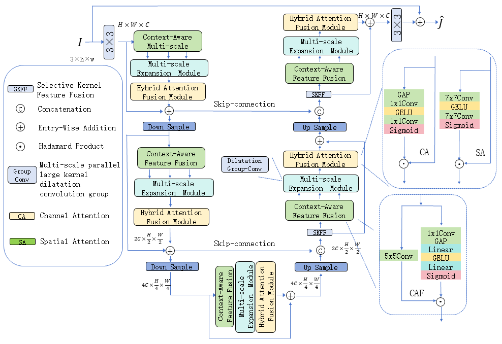

# **Single Image Dehazing Algorithm Driven by Contextual Collaboration and Hybrid Attention Mechanism**

---

This repository provides the implementation of our single image dehazing algorithm, which leverages contextual collaboration and a hybrid attention mechanism. 

## Framework

The architecture of **HACNet** is shown below. 

## Results

### Download Links: - [Google Drive](https://drive.google.com/drive/folders/1MRVD6A_CEAEH_2xqYUTtHdC20nmWbdpk?dmr=1&ec=wgc-drive-hero-goto)

## Acknowledgments

This code is based on [Restormer](https://github.com/swz30/Restormer).
